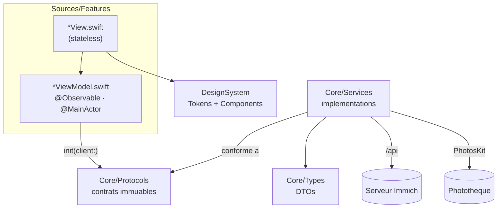

# ImmichSwiftUI

> Client iOS **natif** (SwiftUI) pour [Immich](https://github.com/immich-app/immich), la plateforme photo/vidéo auto-hébergée. Conçu pour **iOS 26** et son langage visuel Liquid Glass — ce n'est pas un port du client Flutter upstream.

ImmichSwiftUI s'appuie sur la même API serveur (`/api`) que le client officiel, avec la même ambition de parité fonctionnelle, mais réécrit pour une expérience 100 % Apple : SwiftUI, intégrations système profondes (Live Activities, Dynamic Island, widgets, App Intents, tâches d'arrière-plan) et une sauvegarde conçue pour de vraies photothèques (streaming disque, RAM bornée).

---

## Sommaire

- [Pourquoi une app native ?](#pourquoi-une-app-native-)
- [Fonctionnalités](#fonctionnalités)
- [Architecture](#architecture)
- [Comment l'app fonctionne](#comment-lapp-fonctionne)
- [Démarrage rapide](#démarrage-rapide)
- [Tests](#tests)
- [Contribuer](#contribuer)

---

## Pourquoi une app native ?

1. **Expérience native.** Le client upstream est en Flutter : excellente parité multiplateforme, mais pas de langage visuel iOS. ImmichSwiftUI suit les HIG et le Liquid Glass d'iOS 26, avec `NavigationStack`, tab bar et sheets natifs.
2. **Intégrations système.** Une Live Activity affiche la progression du backup dans la Dynamic Island et sur l'écran verrouillé ; BGTaskScheduler entretient une chaîne de sauvegardes en arrière-plan ; un App Intent expose « Back up now » à Siri/Shortcuts ; un widget d'accueil lance un backup en un tap.
3. **Performance face aux vraies photothèques.** Le backup est entièrement streamé disque→réseau : hash SHA-1 par blocs, multipart écrit sur disque, upload par fichier. La RAM reste bornée quelle que soit la taille de l'asset — les grosses vidéos iCloud ne tuent pas l'app.
4. **Souveraineté.** Self-hosted, zéro cloud intermédiaire : l'app ne parle qu'à ton serveur Immich.

La parité avec le client Flutter est suivie dans [`docs/mobile-features-vs-flutter.md`](docs/mobile-features-vs-flutter.md).

## Fonctionnalités

| Domaine | Contenu | Code |
|---|---|---|
| **Timeline** | buckets par jour, zoom de grille, vignettes | `Sources/Features/Timeline/` |
| **Visionneuse** | plein écran, zoom, filmstrip, vidéo, diaporama, panneau EXIF, stacks, visages | `Sources/Features/PhotoViewer/` |
| **Recherche** | sémantique (CLIP), visages, lieux (carte), tags, filtres avancés | `Sources/Features/Search/` |
| **Albums** | CRUD, partage, flux d'activité | `Sources/Features/Albums/` |
| **Personnes, tags, doublons, corbeille** | gestion des visages, tags, détection de doublons, restauration | `Sources/Features/People/`, `Tags/`, `Duplicates/`, `Trash/` |
| **Liens partagés** | CRUD, mot de passe, expiration, **visionneuse publique** (ouvrir un lien reçu, le déverrouiller, le parcourir, upload invité) | `Sources/Features/SharedLinks/` |
| **Souvenirs** | « Ce jour-là », visionneuse de moments | `Sources/Features/Memories/` |
| **Éditeur photo** | recadrage, rotation, édition non destructive | `Sources/Features/Editor/` |
| **RoadTrip** | lecteur + export d'un film de voyage (ouverture → diaporama → trajet carte) généré depuis un album | `Sources/Features/RoadTrip/` |
| **Auto-backup** | streaming, dédup serveur, Live Activity, arrière-plan, reprise | `Sources/Features/Upload/` + `Sources/Services/BackupEngine.swift` |
| **Admin** | panneau d'administration serveur | `Sources/Features/Admin/` |
| **Profil** | stockage, verrouillage de l'app (Face ID), choix de la langue | `Sources/Features/Profile/` |
| **Langue** | anglais (source) + français, allemand, espagnol, italien ; suit l'appareil par défaut, épinglable dans l'app, dates localisées | `Resources/Localizable.xcstrings` + `Sources/Features/Settings/` |

Extensions : widget d'accueil « Back up now » (`ImmichWidgets/`), Live Activity de backup (Dynamic Island), App Intent `BackupNowAppIntent` (Siri/Shortcuts).

## Architecture

MVVM strict en 4 couches. Les protocoles de `Core/Protocols/` sont **immuables** et constituent le seul point d'injection ; tout le reste est implémentation ou présentation.

| Couche | Rôle | Contenu |
|---|---|---|
| `Sources/Core/Types/` | DTOs de l'API | `DTOs*.swift`, `SearchDTOs.swift`, `APIError.swift`, … |
| `Sources/Core/Protocols/` | Contrats (seul point d'injection) | `ImmichClient`, `PhotoLibraryService`, `BackupAssetSource`, `BackupLedgerStoring`, `KeychainStore`, `TrustedServerStore`, `AppLockService`, `VideoPlaybackEngine` |
| `Sources/Services/` | Implémentations | `ImmichAPIClient`, `PhotoLibraryServiceImpl`, `BackupEngine`, `BackupLedger`, `MultipartBody`, `ImageCache`, `AuthenticatedAsyncImage`, `RealtimeService` (Socket.IO), `KeychainStoreImpl`, … |
| `Sources/Features/<Feature>/` | MVVM par feature | `<Feature>ViewModel.swift` (`@Observable`, `@MainActor`) + `<Feature>View.swift` (stateless) |

Points de composition :

- **`Sources/DependencyContainer.swift`** — composition root : singleton `@MainActor`, méthodes `make*ViewModel()` qui injectent les protocoles via `init(client:)`. Aucun view model partagé.
- **`Sources/RootView.swift`** — routeur auth-gated : onboarding → `AuthenticatedRoot` (TabView). Un changement de compte détruit le sous-arbre complet (`.id(activeAccountID)`), zéro état résiduel.
- **`Sources/DesignSystem/`** — `Tokens/` (`Color.immich*`, `bgPrimary`/`bgSecondary`, spacing, motion, fonts) + `Components/` (barre d'app, boutons, badges, squelettes). Aucune couleur en dur dans les vues.
- **`Sources/ImmichSharedKit/`** — framework partagé app ⇄ extension widget : attributs et vues ActivityKit de la Live Activity.
- **`ImmichWidgets/`** — extension widget (tuile d'accueil + Live Activity).



## Comment l'app fonctionne

### Authentification

1. Onboarding : URL du serveur (saisie ou scan de QR code) → ping `/api/server/ping` + configuration serveur.
2. Connexion email/mot de passe (`/api/auth/login`) ou OAuth2/OIDC (`ASWebAuthenticationSession`, callback `app.immich:///oauth-callback`).
3. Token stocké dans le Keychain ; à chaque lancement, `restoreSession()` revalide le token et reconstruit la session.
4. App Lock (Face ID) : verrouillage au passage en arrière-plan, overlay `LockView`.

### Données et images

- **`ImmichAPIClient`** : toutes les URLs passent par `ImmichAPI.SubPath` ; token en en-tête ; client thread-safe ; erreurs typées `APIError`.
- **Images** : `AuthenticatedAsyncImage`, pipeline à 3 niveaux (cache mémoire actor-isolé `NSCache`, cache disque, réseau avec en-têtes d'authentification).
- **Temps réel** : `RealtimeService` (Socket.IO) pour les événements serveur.

### Sauvegarde automatique — la pièce maîtresse

`BackupEngine` est une machine à phases : `checking → uploading → done / cancelled`.

1. **Scan** de la photothèque (PhotosKit) avec filtres (screenshots, Camera Roll, WhatsApp).
2. **Passe 1 — hash** : SHA-1 streamé par blocs de 1 Mo ; jamais l'asset entier en RAM.
3. **Déduplication serveur** : `/api/assets/bulk-upload-check`.
4. **Passe 2 — upload** : ré-export sur disque → multipart écrit sur disque → `URLSession.upload(fromFile:)`. RAM bornée, les grosses vidéos sont sauvegardées au lieu d'être écartées.
5. **`BackupLedger`** : les assets déjà sauvegardés ne sont pas ré-exportés — évite de re-télécharger toute la photothèque iCloud « Optimiser le stockage » à chaque run.
6. **Assets iCloud** : états dédiés (téléchargement en cours, retry) avec messages de statut dans l'UI.

Progression fiable : total fixé après filtrage, barre = `processed / total` (chaque asset compte : uploadé, dédupliqué ou échoué).

Surfaces système :

- **Live Activity** (`BackupLiveActivityService`) — progression dans la Dynamic Island et l'écran verrouillé.
- **BGTaskScheduler** — chaîne auto-entretenue de backups en arrière-plan (`app.immich.background-backup`).
- **App Intent** — « Back up now » depuis Siri/Shortcuts ; le widget d'accueil le déclenche via le deep link `app.immich://backup`.

### Navigation

`AuthenticatedRoot` : TabView (Photos, Memories, Albums, Shared) + onglet Recherche natif iOS 26 (`role: .search`, bulle Liquid Glass alignée par le système). Le profil (« Me ») est présenté en sheet depuis l'avatar de chaque onglet.

## Démarrage rapide

### Prérequis

- Xcode avec SDK iOS 26
- [XcodeGen](https://github.com/yonaskolb/XcodeGen) — `project.yml` est la source de vérité du projet ; `ImmichSwiftUI.xcodeproj` est **généré**.

```bash
xcodegen generate
open ImmichSwiftUI.xcodeproj
# choisir un simulateur (iPhone 17, iOS 26), puis ⌘R
```

Au premier lancement : URL de ton instance Immich (ou scan du QR code), puis connexion. N'importe quel serveur Immich récent convient.

## Tests

```bash
xcodebuild test -destination 'platform=iOS Simulator,name=iPhone 17'
```

- ~640 tests dans `Tests/` ; chaque view model est testé avec un `MockImmichClient` injecté via `init(client:)`.
- **Piège** : le target de test source le dossier `Tests/` en entier — un nouveau fichier `Tests/*.swift` n'est compilé qu'après `xcodegen generate`. Sans regénération, les tests passent « verts » par omission.

## Contribuer

Le développement suit une méthodologie par **cartes d'acceptance** (AC). Backlog : [`.omp/backlog/ImmichSwiftUI-backlog.md`](.omp/backlog/ImmichSwiftUI-backlog.md).

1. **Choisir une feature** dans le backlog (tableau de suivi, phases P0–P5, endpoints manquants).
2. **Lire les specs** : `.omp/<feature>/<feature>.specs.md` (exigences) et `<feature>.ui.md` (brief UI : navigation, tokens, comportements).
3. **Implémenter dans l'ordre** : protocole (`Core/Protocols/`) → service (`Services/`) → view model + vue (`Features/`) → design uniquement via les tokens `DesignSystem/`.
4. **Tester** avec un mock injecté, puis `xcodegen generate` et la suite complète.
5. **PR** : une feature = ses cartes AC cochées, ses specs mises à jour.

Conventions à respecter :

- **MVVM strict** : protocoles immuables, injection unique via `DependencyContainer`, view models `@Observable @MainActor` jamais partagés, vues stateless.
- **Navigation** : `NavigationStack` partout pour les écrans navigables.
- **Design** : tokens `DesignSystem` uniquement (`Color.immich*`, `bgPrimary`/`bgSecondary`) ; langage Liquid Glass iOS 26.
- **Tests** : un test défend un comportement observable (jamais l'implémentation, les valeurs par défaut ou le texte des mocks).
- **Mémoire projet** : voir `AGENTS.md` (mem0) — consulte la mémoire avant de débugger ou de trancher une convention.

### Documentation

| Doc | Contenu |
|---|---|
| `docs/immich-swiftui-feature-audit.md` | Audit consolidé des surfaces de features de l'app |
| `docs/mobile-features-vs-flutter.md` | Référence du client Flutter upstream (objectif de parité) |
| `docs/feature-parity-plan.md`, `docs/feature-audit-vs-flutter.md` | Plans de parité Flutter |
| `docs/audit-2026-08.md` | Audit 2026-08 (performance, design, HIG) |
| `.omp/backlog/ImmichSwiftUI-backlog.md` | Backlog : phases, cartes AC, endpoints manquants |
| `.omp/<feature>/` | Specs + briefs UI par feature |
