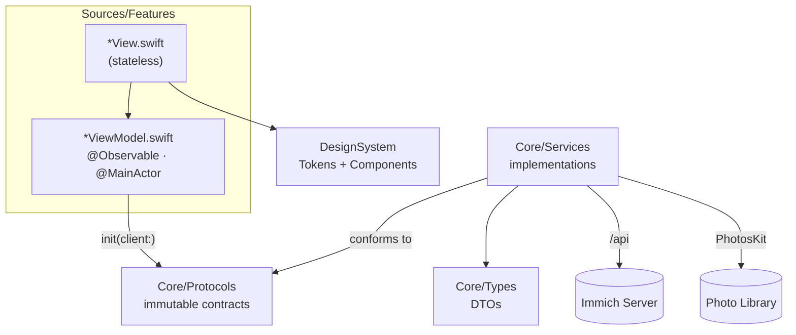

# ImmichSwiftUI

> A **native** iOS (SwiftUI) client for [Immich](https://github.com/immich-app/immich), the self-hosted photo and video platform. Designed for **iOS 26** and its Liquid Glass visual language — this is not a port of the upstream Flutter client.

ImmichSwiftUI uses the same server API (`/api`) as the official client, with the same ambition of feature parity, but rewritten for a 100% Apple experience: SwiftUI, deep system integrations (Live Activities, Dynamic Island, widgets, App Intents, background tasks), and a backup engine built for real photo libraries (disk streaming, bounded RAM).

---

## Table of Contents

- [Why a native app?](#why-a-native-app)
- [Features](#features)
- [Architecture](#architecture)
- [How the app works](#how-the-app-works)
- [Quick Start](#quick-start)
- [Tests](#tests)
- [Contributing](#contributing)

---

## Why a native app?

1. **Native experience.** The upstream client is built with Flutter: excellent cross-platform parity, but no iOS visual language. ImmichSwiftUI follows the HIG and iOS 26's Liquid Glass, using `NavigationStack`, native tab bars, and sheets.
2. **System integrations.** A Live Activity displays backup progress in the Dynamic Island and on the lock screen; BGTaskScheduler maintains a chain of background backups; an App Intent exposes "Back up now" to Siri/Shortcuts; a home screen widget triggers a backup with one tap.
3. **Performance against real photo libraries.** Backup is fully streamed disk→network: SHA-1 hashed in 1 MB blocks, multipart written to disk, uploaded via `URLSession.upload(fromFile:)`. RAM stays bounded regardless of asset size — large iCloud videos don't crash the app.
4. **Sovereignty.** Self-hosted, zero intermediate cloud: the app communicates only with your Immich server.

Feature parity with the Flutter client is tracked in [`docs/mobile-features-vs-flutter.md`](docs/mobile-features-vs-flutter.md).

## Features

| Domain | Content | Code |
|---|---|---|
| **Timeline** | daily buckets, grid zoom, thumbnails | `Sources/Features/Timeline/` |
| **Viewer** | full-screen pager, zoom, filmstrip, video, slideshow, EXIF panel, stacks, faces | `Sources/Features/PhotoViewer/` |
| **Search** | semantic (CLIP), faces, locations (map), tags, advanced filters | `Sources/Features/Search/` |
| **Albums** | CRUD, sharing, activity feed | `Sources/Features/Albums/` |
| **People, Tags, Duplicates, Trash** | face management, tags, duplicate detection, restore | `Sources/Features/People/`, `Tags/`, `Duplicates/`, `Trash/` |
| **Shared Links** | CRUD, password, expiration | `Sources/Features/SharedLinks/` |
| **Memories** | "On this day", moments viewer | `Sources/Features/Memories/` |
| **Photo Editor** | crop, rotate, non-destructive editing | `Sources/Features/Editor/` |
| **RoadTrip** | reader + export of a travel film (opening → slideshow → map route) generated from an album | `Sources/Features/RoadTrip/` |
| **Auto-Backup** | streaming, server dedup, Live Activity, background, resume | `Sources/Features/Upload/` + `Sources/Services/BackupEngine.swift` |
| **Admin** | server admin panel | `Sources/Features/Admin/` |
| **Profile** | storage indicator, app lock (Face ID) | `Sources/Features/Profile/` |

Extensions: home screen widget ("Back up now" tile, `ImmichWidgets/`), backup Live Activity (Dynamic Island), App Intent `BackupNowAppIntent` (Siri/Shortcuts).

## Architecture

Strict MVVM in 4 layers. Protocols in `Core/Protocols/` are **immutable** and form the sole injection point; everything else is implementation or presentation.

| Layer | Role | Content |
|---|---|---|
| `Sources/Core/Types/` | API DTOs | `DTOs*.swift`, `SearchDTOs.swift`, `APIError.swift`, … |
| `Sources/Core/Protocols/` | Contracts (sole injection point) | `ImmichClient`, `PhotoLibraryService`, `BackupAssetSource`, `BackupLedgerStoring`, `KeychainStore`, `TrustedServerStore`, `AppLockService`, `VideoPlaybackEngine` |
| `Sources/Services/` | Implementations | `ImmichAPIClient`, `PhotoLibraryServiceImpl`, `BackupEngine`, `BackupLedger`, `MultipartBody`, `ImageCache`, `AuthenticatedAsyncImage`, `RealtimeService` (Socket.IO), `KeychainStoreImpl`, … |
| `Sources/Features/<Feature>/` | Per-feature MVVM | `<Feature>ViewModel.swift` (`@Observable`, `@MainActor`) + `<Feature>View.swift` (stateless) |

Composition points:

- **`Sources/DependencyContainer.swift`** — composition root: singleton `@MainActor`, `make*ViewModel()` methods injecting protocols via `init(client:)`. No shared view models.
- **`Sources/RootView.swift`** — auth-gated router: onboarding → `AuthenticatedRoot` (TabView). Account switch destroys the full subtree (`.id(activeAccountID)`), no residual state.
- **`Sources/DesignSystem/`** — `Tokens/` (`Color.immich*`, `bgPrimary`/`bgSecondary`, spacing, motion, fonts) + `Components/` (app bar, buttons, badges, skeletons). No hardcoded colors in views.
- **`Sources/ImmichSharedKit/`** — shared framework app ⇄ widget extension: ActivityKit attributes and views for the Live Activity.
- **`ImmichWidgets/`** — widget extension (home screen tile + Live Activity).



## How the app works

### Authentication

1. **Onboarding:** server URL (typed or QR code scan) → ping `/api/server/ping` + server configuration.
2. **Login:** email/password (`/api/auth/login`) or OAuth2/OIDC (`ASWebAuthenticationSession`, callback `app.immich://oauth-callback`).
3. **Token storage:** stored in Keychain; on every launch, `restoreSession()` re-validates the token and rebuilds the session.
4. **App Lock (Face ID):** locks when the app goes to background, overlay `LockView`.

### Data and Images

- **`ImmichAPIClient`**: all URLs pass through `ImmichAPI.SubPath`; token in header; thread-safe client; typed errors `APIError`.
- **Images:** `AuthenticatedAsyncImage`, 3-level pipeline (actor-isolated memory cache `NSCache`, disk cache, network with auth headers).
- **Real-time:** `RealtimeService` (Socket.IO) for server events.

### Auto-Backup — the crown jewel

`BackupEngine` is a phase machine: `checking → uploading → done / cancelled`.

1. **Scan** the photo library (PhotosKit) with filters (screenshots, Camera Roll, WhatsApp).
2. **Pass 1 — hash:** SHA-1 streamed in 1 MB blocks; never the entire asset in RAM.
3. **Server deduplication:** `/api/assets/bulk-upload-check`.
4. **Pass 2 — upload:** re-export to disk → multipart written to disk → `URLSession.upload(fromFile:)`. Bounded RAM, large videos are backed up instead of skipped.
5. **`BackupLedger`:** already-backuped assets are not re-exported — avoids re-downloading the entire "Optimize Storage" iCloud library on every run.
6. **iCloud assets:** dedicated states (downloading, retry) with status messages in the UI.

Reliable progress: total fixed after filtering, bar = `processed / total` (each asset counts: uploaded, deduplicated, or failed).

System surfaces:

- **Live Activity** (`BackupLiveActivityService`) — progress in the Dynamic Island and lock screen.
- **BGTaskScheduler** — self-sustaining chain of background backups (`app.immich.background-backup`).
- **App Intent** — "Back up now" from Siri/Shortcuts; the home screen widget triggers it via deep link `app.immich://backup`.

### Navigation

`AuthenticatedRoot`: TabView (Photos, Memories, Albums, Shared) + native iOS 26 Search tab (`role: .search`, Liquid Glass bubble aligned by the system). Profile ("Me") is presented as a sheet from the avatar on each tab.

## Quick Start

### Prerequisites

- Xcode with iOS 26 SDK
- [XcodeGen](https://github.com/yonaskolb/XcodeGen) — `project.yml` is the project source of truth; `ImmichSwiftUI.xcodeproj` is **generated**.

```bash
xcodegen generate
open ImmichSwiftUI.xcodeproj
# select a simulator (iPhone 17, iOS 26), then ⌘R
```

On first launch: URL of your Immich instance (or QR code scan), then login. Any recent Immich server works.

## Tests

```bash
xcodebuild test -destination 'platform=iOS Simulator,name=iPhone 17'
```

- ~640 tests in `Tests/`; each view model is tested with a `MockImmichClient` injected via `init(client:)`.
- **Trap:** the test target sources the entire `Tests/` folder — a new `Tests/*.swift` file is only compiled after `xcodegen generate`. Without regeneration, tests pass "green" by omission.

## Contributing

Development follows an **acceptance card** (AC) methodology. Backlog: [`.omp/backlog/ImmichSwiftUI-backlog.md`](.omp/backlog/ImmichSwiftUI-backlog.md).

1. **Pick a feature** from the backlog (tracking table, P0–P5 phases, missing endpoints).
2. **Read the specs:** `.omp/<feature>/<feature>.specs.md` (requirements) and `<feature>.ui.md` (UI brief: navigation, tokens, behaviors).
3. **Implement in order:** protocol (`Core/Protocols/`) → service (`Services/`) → view model + view (`Features/`) → design only through `DesignSystem/` tokens.
4. **Test** with a mocked injection, then `xcodegen generate` and the full suite.
5. **PR:** one feature = its AC cards checked, its specs updated.

Conventions to follow:

- **Strict MVVM:** immutable protocols, single injection via `DependencyContainer`, view models `@Observable @MainActor` never shared, stateless views.
- **Navigation:** `NavigationStack` everywhere for navigable screens.
- **Design:** `DesignSystem` tokens only (`Color.immich*`, `bgPrimary`/`bgSecondary`); iOS 26 Liquid Glass language.
- **Tests:** one test defends observable behavior (never implementation, default values, or mock text).
- **Project memory:** see `AGENTS.md` (mem0) — consult memory before debugging or settling conventions.

### Documentation

| Doc | Content |
|---|---|
| `docs/immich-swiftui-feature-audit.md` | Consolidated audit of the app's feature surfaces |
| `docs/mobile-features-vs-flutter.md` | Upstream Flutter client reference (parity target) |
| `docs/feature-parity-plan.md`, `docs/feature-audit-vs-flutter.md` | Flutter parity plans |
| `docs/audit-2026-08.md` | 2026-08 audit (performance, design, HIG) |
| `.omp/backlog/ImmichSwiftUI-backlog.md` | Backlog: phases, AC cards, missing endpoints |
| `.omp/<feature>/` | Specs + UI briefs per feature |
